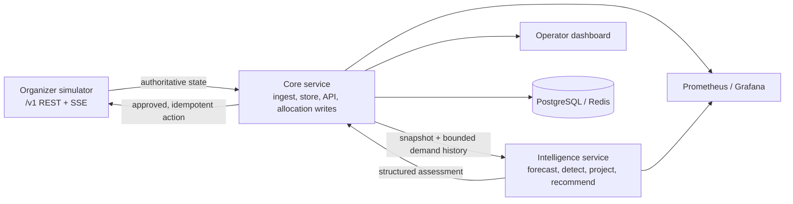

# Fuel Supply Intelligence & Resilience Platform

Decision support for the BUP Fuel Supply Simulator: observe network state, detect shortage and disruption risk, recommend allocations, and make system health visible. All operational activity is simulated; the platform does not control real fuel infrastructure.

## Repository status

This checkout is on branch `jessan_appli` at the Phase 0 foundation commit. It contains the simulator contracts and shared data models, service and frontend scaffolds, Compose configuration, and planning documents. The Core and Intelligence services in this checkout are health-only skeletons; the frontend is a placeholder. The higher-level implementation on `origin/master` includes later ingestion, intelligence, and observability work, but those files are not present in this checkout. See [branch inventory](docs/branch-inventory.md) before treating later-branch features as available here.

## Start the scaffold

Requirements: Docker Desktop with Compose and a checkout of this repository.

```powershell
Copy-Item .env.example .env
docker compose up --build
```

The scaffold Compose stack is configured to expose the simulator on port 8000, Core on 8100, Intelligence on 8200, the frontend on 5173, Prometheus on 9090, and Grafana on 3000. Check actual container health with `docker compose ps`. In this branch, Core and Intelligence only provide `/health`; they do not yet ingest simulator data or produce recommendations.

To stop the stack:

```powershell
docker compose down
```

Simulator operations and deterministic test controls are available through its `/docs` and `/admin` interfaces. Do not use admin endpoints as the application's production integration path; application state must come from `/v1/*`.

## Project documents

- [Problem and scope](ProblemStatement.md) — organizer challenge brief.
- [Team specification](SPEC.md) — architecture, stack, roadmap, and simulator contract notes.
- [Architecture](docs/architecture.md) — current-versus-target system diagram and service boundaries.
- [Branch inventory](docs/branch-inventory.md) — what each visible branch contributes and what is integrated.
- [Intelligence design](docs/intelligence.md) — implementation observed in the later integrated branch, its data flow, and its limits.
- [Requirements](docs/requirements.md) — requirement IDs and acceptance criteria.
- [Task board](docs/task-board.md) — planned work and recorded status for this checkout.
- [API contracts](docs/api-contracts.md) — verified simulator contract and service boundaries.
- [Verification log](docs/verification.md) — evidence actually recorded; distinguish from planned checks.
- [Demo flow](docs/demo-flow.md) — proposed demonstration sequence; only verified steps should be presented as live evidence.

## Architecture at a glance



This diagram is the intended integrated architecture. The exact implementation state depends on the checked-out branch; see the branch inventory.

## Development principles

1. The simulator is the operational source of truth; SSE events prompt a REST refresh and are not authoritative state.
2. Core owns simulator access and allocation writes. Intelligence evaluates Core-supplied snapshots and never writes to the simulator.
3. Recommendations explain their signals, constraints, expected impact, and uncertainty. Human review remains in control of consequential actions.
4. The deterministic baseline and fallback must work without an external LLM. LLM narration is optional and explanation-only.
5. Keep plans, implementation, and verification evidence distinct. Do not label an item complete without code or recorded verification.
