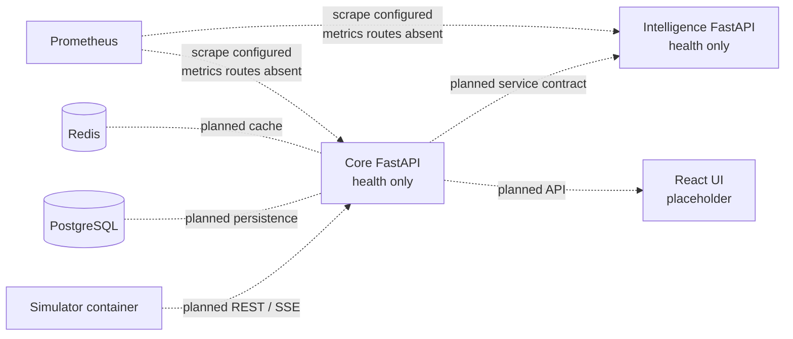
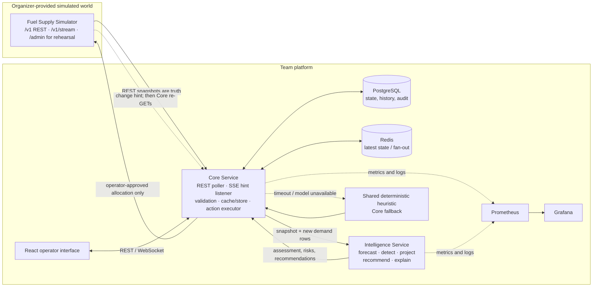

# Architecture

This page separates the architecture present in the current checkout from the intended integrated design. Branch details and exact source refs are in [branch-inventory.md](branch-inventory.md). Requirements are indexed in [requirements.md](requirements.md); accepted choices are in [decisions.md](decisions.md).

## Current checkout: `jessan_appli`

Solid implementation in this branch consists of service shells, shared simulator models, and deployment scaffolding. Dashed edges and data stores describe the planned architecture, not working data flow in this checkout.

## Intended integrated architecture

## Ownership and trust boundaries

| Component | Owns | Does not own |
|---|---|---|
| Simulator | Simulated world state, event execution, allocation outcomes | Team forecasts or decisions |
| Core | Simulator client, polling/SSE resync, input validation, cached state, persistence, frontend API, idempotent allocation writes | Forecast algorithms or direct operator-facing decisions |
| Intelligence | Analysis of supplied snapshots/history; forecasts, signals, risk, candidate plans, explanations | Simulator calls, allocation submission, approval |
| Shared policy module | Deterministic allocation fallback callable by Core when Intelligence is unavailable | Network access or state mutation |
| Frontend | Shows state and recommendation rationale; operator review/approval interaction | Direct simulator access or decision execution |

| Component | Responsibility | Technology | Requirement IDs |
|---|---|---|---|
| Simulator client (in Core) | Poll REST, listen to SSE, re-GET on every event; normalize both error envelopes (`detail` vs `error`); detect `X-Simulator-Stale`; retry/backoff/timeout | httpx, httpx-sse, tenacity | REQ-002, 003, 004, 010 |
| State store (in Core) | Postgres for allocations, predictions, audit log, demand snapshots; Redis for latest-state cache and fan-out | PostgreSQL, Redis | REQ-002, 022 |
| Intelligence Service | Per-station/fuel forecast, z-score anomaly detection, heuristic then optimization allocator, LLM narration | scikit-learn, XGBoost, OR-Tools/PuLP, OpenAI API | REQ-007, 008, 035 |
| Fallback allocator | Deterministic heuristic that works when Intelligence is down | Python module (location: open item) | REQ-009 |
| Allocation executor (in Core) | Only writer to `POST /v1/allocations` and `/cancel`; deterministic keys (ADR-004); confirms each write with a follow-up REST read | FastAPI, httpx | REQ-005, 006 |
| Core API | REST + WebSocket for the dashboard; the frontend never reaches the simulator | FastAPI | REQ-001 |
| Operator dashboard | Status grid (depots/stations/routes), alerts feed, recommendation review/approve, decision history, health page; labelled as simulated data | React, TS, Vite, Recharts | REQ-001, 008, 014 |
| Observability | App, system, and intelligence metrics; structured logs; health aggregation; Grafana dashboard | Prometheus, Grafana, structlog | REQ-013, 014, 026 |
| Load test | Locust against the allocation/decision path | Locust | REQ-015 |
| CI/CD | Lint, test, build, push | GitHub Actions | REQ-020 |

The integrated `origin/master` Intelligence design adds an offline-capable profile forecaster, CUSUM detection, two-echelon projection, a default heuristic with optional LP, review confidence rules, and optional OpenAI narration. Details and evidence boundaries are in [intelligence.md](intelligence.md) and [ml-architecture.md](ml-architecture.md).

## Failure handling targets

| Failure | Intended response |
|---|---|
| Intelligence timeout/unavailable | Core invokes shared heuristic, marks output degraded/fallback, requires human review |
| Invalid simulator payload | Reject snapshot, alert, preserve last good state |
| Stale simulator response | Show stale state and reduce recommendation confidence |
| SSE loss or queue overflow | Keep polling; reconnect and fully resync over REST |
| Optional LLM unavailable | Return deterministic template explanation |
| Low confidence / consequential scarcity | Require operator review before action |

| Failure | User-visible behavior | Fallback | Owner | Verified |
|---|---|---|---|---|
| Simulator `unavailable` / `error_rate` (503) | Status page: simulator degraded; last-known-good state shown with age | Retry with backoff, circuit breaker, cached state from Redis/Postgres; new submissions blocked or clearly queued | Integration | NO |
| Simulator `latency` | Slower updates; p95 metric rises | Per-call timeout ceiling; loading/degraded indicator | Integration | NO |
| `stale_data` header | Affected panels flagged stale | Stale inputs lower confidence; may trigger human review | Integration | NO |
| `stream_disconnect` / SSE queue overflow | Updates continue at polling freshness | Backoff reconnect; full REST resync on reconnect | Integration | NO |
| Invalid simulator response | Alert raised; input rejected | Pydantic validation at the client boundary; state not corrupted | Integration | NO |
| Intelligence Service down or model error | Recommendation still produced, marked "fallback policy" | Fallback heuristic in Core | Intelligence | NO |
| Low prediction confidence | Recommendation flagged "human review required" | Manual approval path | Intelligence + Frontend | NO |
| OpenAI API down or slow | Recommendation shown with templated explanation | Templated narration | Intelligence | NO |
| Postgres or Redis down | Health page red for that component; dashboard serves what it can | Redis down: read direct from Postgres/simulator. Postgres down: degraded mode, audit writes buffered or logged | DevOps | NO |
| Allocation 409 family | Specific reason shown (e.g. route disrupted) | Suggest alternate route/depot/quantity | Integration + Intelligence | NO |
