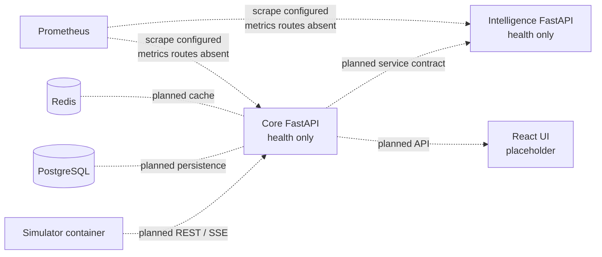
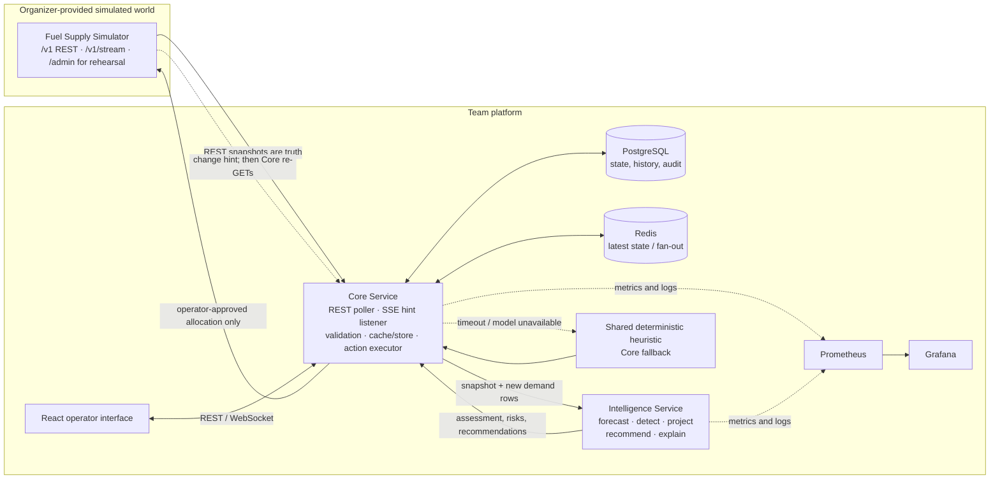

# Architecture

This page separates the architecture present in the current checkout from the intended integrated design. Branch details and exact source refs are in [branch-inventory.md](branch-inventory.md). Requirements are indexed in [requirements.md](requirements.md); accepted choices are in [decisions.md](decisions.md).

## Current checkout: `jessan_appli`



Solid implementation in this branch consists of service shells, shared simulator models, and deployment scaffolding. Dashed edges and data stores describe the planned architecture, not working data flow in this checkout.

## Intended integrated architecture



## Ownership and trust boundaries

| Component | Owns | Does not own |
|---|---|---|
| Simulator | Simulated world state, event execution, allocation outcomes | Team forecasts or decisions |
| Core | Simulator client, polling/SSE resync, input validation, cached state, persistence, frontend API, idempotent allocation writes | Forecast algorithms or direct operator-facing decisions |
| Intelligence | Analysis of supplied snapshots/history; forecasts, signals, risk, candidate plans, explanations | Simulator calls, allocation submission, approval |
| Shared policy module | Deterministic allocation fallback callable by Core when Intelligence is unavailable | Network access or state mutation |
| Frontend | Shows state and recommendation rationale; operator review/approval interaction | Direct simulator access or decision execution |

The simulator REST API is authoritative. SSE is a notification that state may have changed; after any event or reconnect, Core fetches the relevant REST state. `/admin/*` is for test/demo setup and bypasses injected faults; the application integrates through `/v1/*`.

## Decision and data flow

```mermaid
sequenceDiagram
  participant S as Simulator
  participant C as Core
  participant I as Intelligence
  participant U as Operator UI
  C->>S: GET current /v1/* state and bounded demand history
  S-->>C: validated snapshot; stale header is preserved
  C->>I: POST snapshot + new demand rows
  I->>I: forecast → detect → project → rank plan → explain
  I-->>C: assessment with uncertainty, alternatives, constraints
  C-->>U: display risks and review status
  U->>C: operator approves eligible action
  C->>S: POST /v1/allocations with deterministic idempotency key
  S-->>C: allocation outcome
  C->>S: REST confirmation / later status refresh
  C-->>U: updated decision and shipment status
```

The integrated `origin/master` Intelligence design adds an offline-capable profile forecaster, CUSUM detection, two-echelon projection, a default heuristic with optional LP, review confidence rules, and optional OpenAI narration. Details and evidence boundaries are in [intelligence.md](intelligence.md) and [ml-architecture.md](ml-architecture.md).

## Failure handling targets

| Failure | Intended response |
|---|---|
| Intelligence timeout/unavailable | Core invokes shared heuristic, marks output degraded/fallback, requires human review |
| Invalid simulator payload | Reject snapshot, alert, preserve last good state |
| Stale simulator response | Show stale state and reduce recommendation confidence |
| SSE loss or queue overflow | Keep polling; reconnect and fully resync over REST |
| Optional LLM unavailable | Return deterministic template explanation |
| Low confidence / consequential scarcity | Require operator review before action |

These are design behaviors; check `docs/verification.md` and the branch inventory for what has actually been exercised in a given branch.
