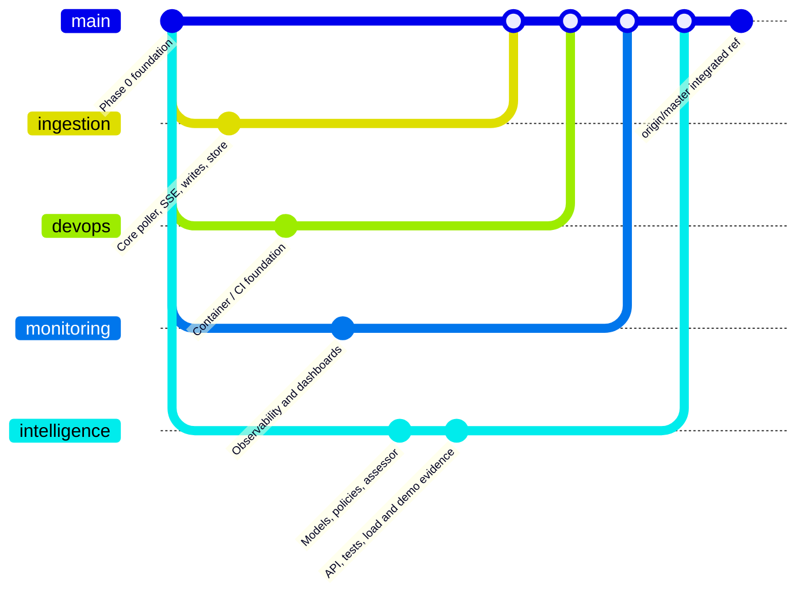

# Branch inventory

Audit date: 2026-09-29. This records the refs visible in the local Git repository at the time of review. It does not fetch branches or change the checked-out branch.

## Current checkout

`jessan_appli` is checked out at `f9851b8`, the same commit as local `anindo`, `main`, and `master`. The working tree was clean during the audit. This is the Phase 0 foundation: simulator contract research/models, Docker Compose scaffold, empty Core and Intelligence health services, placeholder frontend, and planning docs. It does not contain the later service implementation.

## Visible branches and contribution summary

| Ref | Commit / relationship | Contribution visible in that ref | Status relative to this checkout |
|---|---|---|---|
| `origin/abrar/foundations` | `33c2e2d`, parent of current foundation merge | Simulator contracts, shared simulator models, initial Compose/CI scaffold | Already part of current checkout |
| `origin/abrar/ingestion` | `f9b8f14`, ancestor of `origin/master` | Core simulator client, poller/SSE ingestion, allocation executor, state store, tests | Not present in current checkout; incorporated into `origin/master` |
| `origin/devops/foundation` | `1764e86`, merged into `origin/master` | Container hardening, build workflow and developer scripts | Not present in current checkout; incorporated into `origin/master` |
| `origin/devops/observability` | `260dd21`, merged into `origin/master` | Shared observability contract and initial metrics/health wiring | Not present in current checkout; incorporated into `origin/master` |
| `origin/devops/monitoring` | `4039768`, merged into `origin/master` | Prometheus/Grafana/Loki/Alertmanager/Alloy configuration and simulator exporter | Not present in current checkout; incorporated into `origin/master` |
| `origin/Anindo` | `30cc583`, merged into `origin/abrar/sync` then `origin/master` | Intelligence algorithms, trained profile artifacts, API wrapper, tests, load test and rehearsal artifacts | Not present in current checkout; incorporated into `origin/master` |
| `origin/abrar/sync` | `857f9f9`, merged into `origin/master` | Integrates Phase 2 Intelligence work and switches narration provider to OpenAI | Not present in current checkout; incorporated into `origin/master` |
| `origin/Anindo-UI` | `8d3f453`; not an ancestor of `origin/master` | Separate UI changes | Not included in `origin/master` at audit time; review/merge separately before claiming it is integrated |
| `origin/master` | `21f6d12`, remote default branch | Combined ingestion, intelligence, DevOps and monitoring contributions | Most complete integrated ref visible; not checked out here |

The current branch is not a descendant of the later remote integration. Do not infer that a feature visible in `origin/master` is present in `jessan_appli`. In particular, the checked-out Intelligence service still has only `/health`.

## Integration map

The graph is a conceptual contribution map, not a literal commit graph: the exact merge topology is in `git log --graph --all`.

## How to check a different ref safely

Use `git show <ref>:<path>` or `git diff <current-ref>..<other-ref> -- <path>` for read-only inspection. Before switching branches, check `git status`; preserve any uncommitted work. The current documentation intentionally describes both the checked-out foundation and later integrated work, labeling each clearly.

