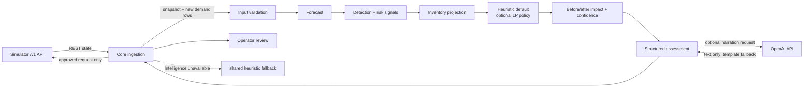

# Intelligence system

This document describes two separate states:

- **Current checkout `jessan_appli`**: Intelligence is a FastAPI health-only scaffold. The implementation below is the code visible in the later integrated `origin/master` ref at commit `21f6d12`, especially `intelligence/` and `shared/`. See [branch inventory](branch-inventory.md) before assuming those files exist in the active checkout.
- **Integrated implementation**: Code-based description of the later ref. It is not evidence that every requirement has passed a live end-to-end demonstration.

## Responsibility boundary

The Intelligence service is an analysis component. It receives a validated snapshot and newly observed demand rows from Core, then returns a structured assessment. It does not fetch simulator data or submit allocations. Core owns simulator integration and action execution. The shared deterministic heuristic is intended to let Core make a safe fallback recommendation when the Intelligence service is unavailable.

## Integrated code flow

The later branch exposes the orchestration in `intelligence/assess.py` and `intelligence/service.py`, with supporting components:

1. **Boundary validation** — `intelligence/models.py` parses the snapshot and demand rows with Pydantic. `Snapshot.from_api` in shared code creates the domain state. Invalid or inconsistent state is rejected rather than used to generate a plan.
2. **Demand forecast** — `intelligence/forecast.py` uses a learned time-of-day profile, regional factor, known event multiplier schedule, and a bounded EWMA correction for unexplained shifts. It returns quantile intervals and cumulative demand projections. Model/profile parameters are stored under `intelligence/artifacts/profile-v1/`.
3. **Anomaly detection** — `intelligence/detect.py` implements a streaming two-sided CUSUM on log(actual/expected) by station and fuel. The detector state is maintained by the assessor between calls and reset when the simulator tick resets.
4. **Operational signals** — `intelligence/signals.py` compares state snapshots and demand to identify event/state changes, stale data, inventory changes, route/depot/station disruptions, delayed/short supply, at-risk allocations, overflow, and systemic shortage.
5. **Projection** — `shared/projection.py` rolls depot and station inventories forward, including demand, arrivals, transit and capacity limits. It estimates stockout timing, unmet litres, overflow, and network cover.
6. **Decision policy** — `shared/heuristic.py` is the deterministic low-dependency allocator and the default policy in the documented design. `intelligence/policy_lp.py` contains an optional rolling-horizon linear program using SciPy HiGHS. Its output is compared with the heuristic in replay/live benchmarks; the code can select `heuristic` or `lp`.
7. **Assessment assembly** — `Assessor.assess` combines forecasts, signals, risk, candidate moves, alternatives, constraints, before/after impact and confidence/review reasons into the output contract.
8. **Explanation** — `intelligence/narrate.py` supplies deterministic templates. When explicitly requested and configured, it can call OpenAI to rewrite explanations, incident summaries, state summaries, or answer bounded questions about the latest assessment. Numeric consistency checks reject unsupported numbers; failures fall back to templates.

## Forecasting and learning

The implementation favors a compact simulator-specific profile over a large general-purpose model. The simulator scenario has repeated demand profiles, 96 ticks per simulated day, and known scheduled events. `intelligence/train.py` builds profile/model artifacts from exported simulator data, fits on training days, tunes on validation days, and reports held-out test metrics. At runtime, the profile baseline works without an external model endpoint or GPU.

This differs from the early SPEC wording that proposed seasonal-naive plus XGBoost. The later implementation documents XGBoost as unnecessary for the measured baseline and instead uses the profile forecaster. Treat that as a data-backed implementation choice only where the checked-in benchmark artifacts support it; do not claim general superiority without the stated evaluation context.

Forecast uncertainty is represented through quantiles/conformal intervals. Confidence and human review also account for regime changes, active/scheduled events, stale/gapped inputs, short history, forecast error, and consequential fallback/scarcity decisions. A confidence value is not a calibrated probability of success unless the evaluation establishes that interpretation.

## Decision policy and safeguards

- The heuristic ranks urgent station/fuel needs by projected stockout relative to route lead time, then chooses feasible routes and shipments under inventory, shipment, dispatch and destination constraints.
- The optional LP looks across a longer horizon and is a comparator/alternate policy. The documented design says to keep it only if benchmark results justify the extra solver complexity.
- Plans are recommendations. Core performs the final simulator write, uses an idempotency key, handles conflicts, and reconciles the result.
- Fallback and scarcity recommendations are marked for human review. Core/UI must enforce that review status before action; an Intelligence response alone cannot enforce the operator workflow.
- Template explanations are always available. LLM output cannot change quantity, route, risk, or other structured decisions.

## Service interface in the integrated ref

See the full contract in `docs/api-contracts.md` on the integrated ref.

| Endpoint | Role |
|---|---|
| `POST /intel/assess` | Input snapshot + new demand rows; returns forecast, signals, risks, projections, recommendations and bottlenecks |
| `POST /intel/ask` | Answers a bounded operator question from the latest assessment |
| `GET /intel/summary` | Returns incident and state summaries from the latest assessment |
| `GET /health`, `GET /ready` | Liveness/component state and readiness of the required model |
| `GET /metrics` | Prometheus HTTP and Intelligence-specific metrics |

The design expects Core to call `/intel/assess` once per new simulator tick with a short timeout and no narration on the hot path. On timeout or model unavailability, Core should use the shared heuristic. Invalid input should preserve the last good data and raise an alert. The optional LLM paths should be invoked separately from time-critical decision generation.

## Offline and online behavior

| Capability | Network requirement | Behavior if offline |
|---|---|---|
| Profile forecast, CUSUM, projection, heuristic | None beyond receiving data from Core | Runs locally with packaged artifacts and code |
| LP optimizer | No external service; local SciPy solver | Runs locally if SciPy is installed; otherwise use heuristic |
| Core ingestion | Must reach the simulator container/API | Cannot refresh; Core should expose cached state as stale/degraded |
| OpenAI narration | Internet and `OPENAI_API_KEY` | Uses deterministic template explanation |

Thus Intelligence is locally executable and its core decisions do not require an online LLM. The complete platform still depends on Core being able to reach the simulator for current data.

## Metrics and validation

The integrated service exports request/latency/error and Intelligence metrics such as forecast error, confidence, shortage alerts, recommendation counts, fallback count, signals, invalid snapshots, LLM outcomes, latest tick, and projected unmet litres. Tests cover model parsing, service schemas, stale and invalid inputs, policy behavior, signals, narration fallback, and observability. Replay and live benchmark tools exercise baseline/crisis behavior; load-test and demo artifacts are checked in on the integrated ref.

Before calling the system end-to-end verified, confirm that:

- tests actually ran (some test suites skip when optional dataset artifacts are absent);
- forecast evaluation uses a held-out time split and records metrics;
- crisis detector precision/recall and detection delay are reported;
- live simulator benchmarks are clearly distinguished from offline replay;
- Core calls the Intelligence API and honors fallback/review behavior;
- UI prevents unapproved human-review recommendations from being submitted.

## Remaining or conditional work

The early foundation branch has all of this intelligence implementation remaining. In the later integrated ref, verify current task/verification records before assuming completion. Areas called out in the integrated README/design include the live benchmark, evaluation on the downloaded labeled crisis dataset, and end-to-end Core/UI integration. Optimization is optional and should remain only if it improves measured service outcomes. Narration is optional and online-dependent. RL is not required by SPEC.md.

