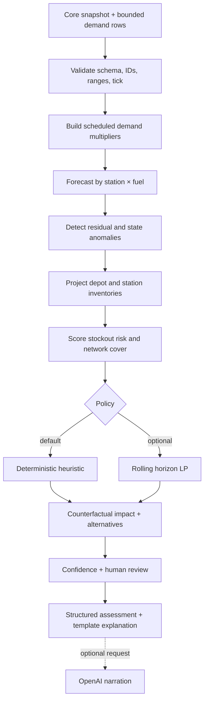

# Intelligence and decision architecture

Status: describes the Intelligence implementation visible in `origin/master` at `21f6d12`; it is not present in the checked-out `jessan_appli` foundation. See [branch-inventory.md](branch-inventory.md) and the service overview in [intelligence.md](intelligence.md).

## Analysis pipeline

The short-horizon forecast supports risk and routing decisions; the longer inventory projection captures scarcity, arrivals, route lead times, and depot overflow. Core uses a shared heuristic if the service is unavailable.

## Forecast model

The profile forecaster models expected demand as a station/fuel time-of-day profile adjusted by region demand factor and a future multiplier schedule. The schedule incorporates current station multipliers and known scheduled/active demand-spike events. A recent EWMA ratio adjusts for unexplained shifts, and the correction is bounded/decayed across the forecast horizon. Empirical residual quantiles provide uncertainty intervals; the system reports both per-tick and cumulative forecast fields.

The simulator has 96 fifteen-minute ticks per simulated day. This gives the model a repeated daily pattern and a cold-start profile. Runtime inference uses packaged model artifacts and NumPy; it does not require a network model endpoint. Training/evaluation code builds artifacts from simulator exports with chronological train, validation, and test splits.

**Evaluation requirements:** report held-out MAE/MAPE and interval coverage by station/fuel; separately evaluate crisis windows. Compare with a simple same-time-of-day or seasonal-naive baseline. Do not use test days for fitting or threshold selection.

## Detection and signals

The statistical detector uses a two-sided CUSUM on log(actual/expected demand) per station/fuel series. It is intended to detect sustained deviations more promptly than a single-tick z-score. State-change signals cover declared events and operational changes that do not necessarily alter demand history: outage, route disruption, depot constraint/closure, supply delay/shortfall, inventory anomaly, and allocation at risk. System-level signals include projected depot overflow, insufficient network cover, stale input, and tick gaps.

For each event/signal family, evaluation should report precision, recall, false alarms, and ticks-to-detect. A declared event signal is operational awareness, not evidence that statistical detection independently discovered the event.

## Inventory projection and allocation

Projection rolls depot and station inventories forward by tick, bounded by capacity. It incorporates demand forecasts, supply arrivals and status, in-transit/pending shipments, route transit times, disruptions and dispatch limits. It yields stockout timing, unmet litres, overflow loss, and network cover by fuel.

The heuristic ranks urgent station/fuel pairs by stockout slack after route lead time, selects feasible source/route candidates, and caps shipments by source stock, route limit, dispatch capacity, destination headroom, and existing inbound allocation. It is deterministic and dependency-light, making it suitable for Core fallback.

The optional LP uses SciPy's HiGHS solver over a rolling horizon. It couples station/depot inventory balance with shipments, transit, route availability, dispatch capacity, and capacity constraints. It should remain an optional comparator until replay and live results show an operational improvement over the heuristic (for example service level/unmet litres without an unacceptable shipment or latency increase).

## Confidence and review

Confidence combines data quality and regime indicators such as stale/gapped state, short history, active events, detector alarms, and recent forecast error. Hard review rules also apply to fallback and consequential scarcity actions. Return the score plus readable reasons. Do not describe this score as a calibrated success probability unless calibration has been measured.

## Explainability contract

For each recommendation, retain structured facts: station/fuel, projected stockout, selected depot/route/quantity, constraints that limited the quantity, alternatives, and before/after impact. A deterministic explanation is always available. Optional OpenAI narration receives a completed object and can only produce prose; structured decisions never come from the LLM. Enforce timeout and template fallback, label simulated content, and reject unsupported numeric claims.

